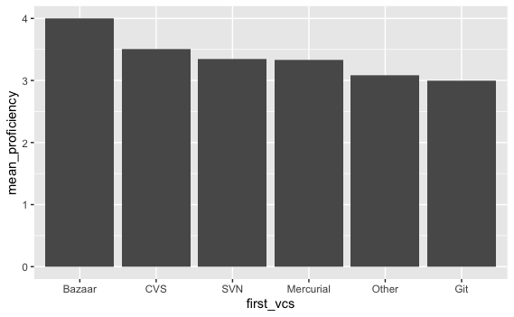

## Setup your environment

```{r}

# Load required libraries

library(tidyverse)

```

## Load your data

```{r}

# load using included script file

source('data/git_experience/load_git_experience.R')

```

## Plot the responses to "Which version control system did you start out using?"

```{r}

# use the variable called "first_vcs"

# hint: there is a geom that will take a single discrete variable and count the data points in
# each category

ggplot(git_experience, aes(x=first_vcs)) +
  geom_bar()

```

## Reproduce the same plot using the "count" function and a different geom

```{r}

git_experience %>% 
  count(first_vcs) %>%
  ggplot(aes(x=first_vcs, y=n)) +
    geom_col()

# or #

ggplot(data = git_experience %>% count(first_vcs),
       mapping = aes(x=first_vcs, y=n)) +
  geom_col()

```

## Take either plot and use factors to reorganize the categories

```{r}

# update the dataset so that the categorical variable is treated
# as a factor, and the order of the factor levels corresponds
# to their frequency in some way

git_experience %>%
         drop_na(first_vcs) %>%
         mutate(first_vcs = as_factor(first_vcs) %>% 
             fct_infreq()) %>%
  ggplot(aes(x=first_vcs)) +
    geom_bar()

```

## Advanced: Use a different color for each opinion level

```{r}

git_experience %>%
         drop_na(first_vcs) %>%
         mutate(first_vcs = as_factor(first_vcs) %>% 
             fct_infreq()) %>%
  ggplot(aes(x=first_vcs, fill=first_vcs)) +
    geom_bar()

```

## Advanced: Add "regularly_teach" as a fill color to the bars

```{r}

git_experience %>%
         drop_na(first_vcs) %>%
         mutate(first_vcs = as_factor(first_vcs) %>% 
             fct_infreq()) %>%
  ggplot(aes(x=first_vcs, fill=regularly_teach)) +
    geom_bar()

```

## Talk it out: what are the general steps you would take to make this chart?



```{r}

# Step 1: group the data by "first_vcs" (optional: drop NAs first)
# Step 2: summarize the groups by calculating the mean of "proficiency"
# Step 3: mutate "first_vcs" so it is ordered by the values for the mean of 
#   "proficiency", in descending order
# Step 4: plot the data using geom_col()

git_experience %>% 
  drop_na(first_vcs) %>%
  group_by(first_vcs) %>% 
  summarise(mean_proficiency = mean(proficiency, na.rm=TRUE)) %>%
  mutate(first_vcs = as_factor(first_vcs) %>% 
           fct_reorder(mean_proficiency) %>% fct_rev()) %>%
  ggplot(aes(x=first_vcs, y=mean_proficiency)) +
    geom_col()

```


## Plot the responses to "When did you first start using a version control system?"

```{r}

# use the variable called "year_vcs" and geom_line()
# what needs to happen to the data for geom_line to work?
# Hint: try geom_bar() first if you're not sure how to get started

ggplot(git_experience, aes(x=year_vcs)) +
  geom_bar()

# Explanation: geom_bar() performs a count for you, so you only need to 
# provide one variable. For geom_line, you need to provide both x and y,
# so you need to count the number of responses for each year before
# creating the chart.

git_experience %>% count(year_vcs) %>%
  ggplot(aes(x=year_vcs, y = n)) +
    geom_line()

```

## Create another line chart of year_vcs that has separate lines (in separate colors) for each category in first_vcs

```{r}

# Hint: you still need to process the data for this chart, but it will
# look a bit different. Think about what data you need for each line and
# how that data could all appear in the same table.

git_experience %>% count(year_vcs, first_vcs) %>%
  ggplot(aes(x=year_vcs, y=n, color=first_vcs)) +
    geom_line()


```

## Use alternative geoms to plot "first_vcs" by "year_vcs"

```{r}

# Plot "year_vcs" on the x axis and "first_vcs" on the y axis
# Try out the following geoms, adjusting the data as needed
# - geom_count()
# - geom_point() --> hint: make this look like geom_count by adding a new aes()
# - geom_jitter()
# - geom_tile() --> hint: this is designed to use fill, thought it's not required

ggplot(git_experience, aes(x=year_vcs, y=first_vcs)) +
  geom_count()

git_experience %>% count(year_vcs, first_vcs) %>%
  ggplot(aes(x=year_vcs, y=first_vcs, size=n)) +
    geom_point()

ggplot(git_experience, aes(x=year_vcs, y=first_vcs, color=first_vcs)) +
  geom_jitter()

git_experience %>% count(year_vcs, first_vcs) %>%
  ggplot(aes(x=year_vcs, y=first_vcs, fill=n)) +
    geom_tile()

```

