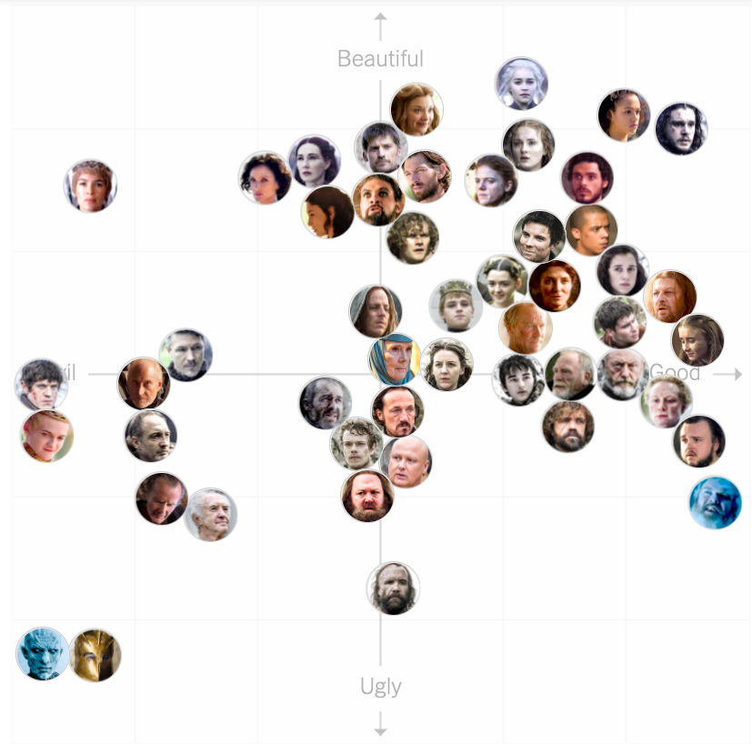

## Load packages

```{r}

library(tidyverse)

```

## Model chart



## Load data

```{r, message=FALSE}

# load using included script file

# data comes from https://int.nyt.com/newsgraphics/2017/2017-07-17-got-matrix/mean.json
# data based on ratings using tool at https://www.nytimes.com/interactive/2017/08/09/upshot/game-of-thrones-chart.html

got <- read_csv("../data/got_ratings.csv")

```


```{r}

got_plot <- ggplot(got, aes(x=moral,y=physical, color=gender)) + 
              geom_point(alpha=.75) + 
              geom_text(aes(label=label), nudge_y = -.025, show.legend = FALSE) +
              coord_cartesian(clip="off")

got_plot

```

## Practice Labels

```{r}

# To improve this plot so it is a bit more ready for publication, we're going to add
# a layer called labs(), which allows us to edit labels on the chart like the 
# main title, axis titles, and legend titles.

# Review:
# https://ggplot2.tidyverse.org/reference/labs.html

# Update the previous chart to add/modify labels for the following chart elements 
# and aesthetics: title, x, y, color

labels <- labs()

got_plot +
  labels

```

## Practice Axis Scales

```{r}

# Labels only get us so far. For the text inside the chart elements like
# the axes and the legends, we have to use layers called "scales".

# Picking the right name of the scale can be tricky. There are three main
# components of the scale name:
# 1. the word "scale"
# 2. the name of the aesthetic you want to modify (e.g., "x", "y", "size", "fill")
# 3. the data type (either "discrete" or "continuous") or a specific pre-defined
#    transformation

# In the above plot, we want to specify that both the x and y axis should 
# go from 0 to 1. For that, we would build scales to edit the x and y axis,
# which are both mapped to continuous variables. For the x axis, you specify:
# 1. "scale"
# 2. "x"
# 3. "continuous

# Review the scale documentation: 
# https://ggplot2.tidyverse.org/reference/scale_continuous.html

# First, add the scale as a new layer, separating each part with "_".

# Next, look in the documentation for something that will change the
# start and end points of the axis. Set the points to 0 and 1 for both axes.

got_plot +
  labels +
  # add scales for x and y axis

```

```{r}

# In the target visualization, the characters "Night King" and "Mountain" are
# in the bottom-left corner instead of the top left corner. Scales can also control
# the direction of the axis. Check out the scales functions and find one that
# will flip the y axis.

# https://ggplot2.tidyverse.org/reference/index.html#section-scales

# Once you find a new function for the y axis, use that one instead of the 
# generic "scale_y_continuous" function we used earlier. Does it work right
# away? If not, what else might you have to change?


```

## Practice Color Scales

```{r}

# For plots with a light background (e.g., white or grey), it's helpful to
# use dark colors for chart components so they will show up well against
# the background. We can use scales to manually select two darker colors
# for our character gender values.

# Review https://ggplot2.tidyverse.org/reference/scale_manual.html

# To assign specific colors to each category, you can make a list of colors --
# either R built-in color names or color specifications using the rgb() function.

# To print a list of all valid color names in R, use colors()

# First, build a list of two color names to use in the plot.

colors <- c()

# Next, add a manual fill scale to the chart and set the values to
# your new colors vector.


```
## Practice Reference Lines

```{r}

# The original chart has arrows dividing the chart into four quadrants.
# In ggplot2, elements like this can be created using reference lines, which
# are actually special geom layers.

# Review: https://ggplot2.tidyverse.org/reference/geom_abline.html

# Add two reference lines (one horizontal, one vertical) positioned exactly
# in the middle of each axis.


```


## Practice Themes

```{r}

# The original chart has a very simple background: no color, no plot borders, 
# no gridlines.
# Explore the built-in ggplot2 themes to find one that will remove some of the
# extra plot elements.

# https://ggplot2.tidyverse.org/reference/index.html#section-themes


```

```{r}

# We can continue to customize the theme using theme(). Let's remove the 
# gridlines (panel.grid) and the axis text (axis.text).

# To remove elements, set them equal to element_blank().

# Review: https://ggplot2.tidyverse.org/reference/theme.html


```

