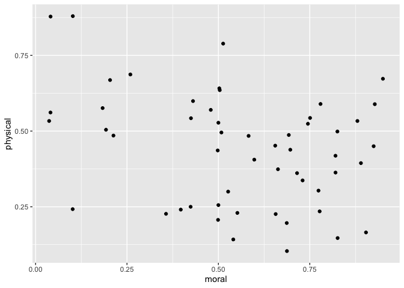
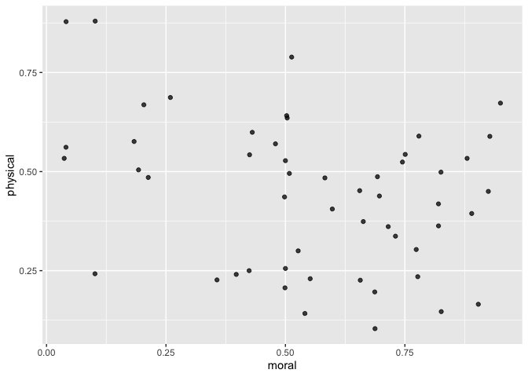
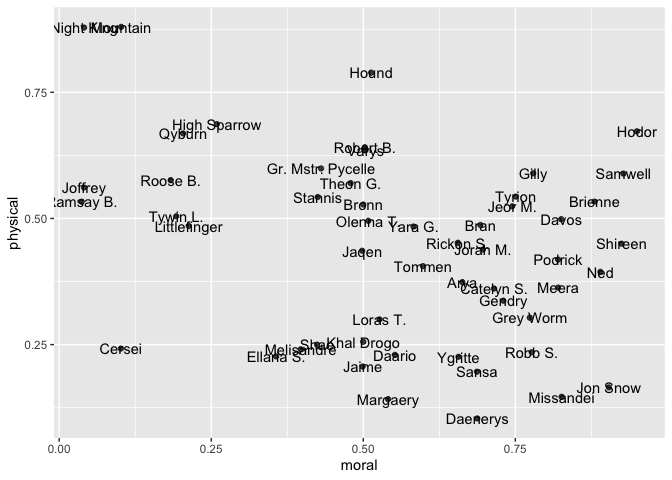
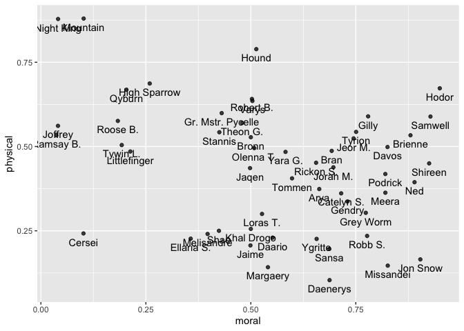
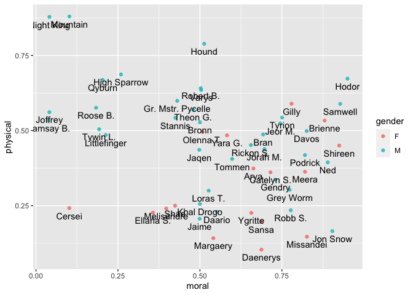
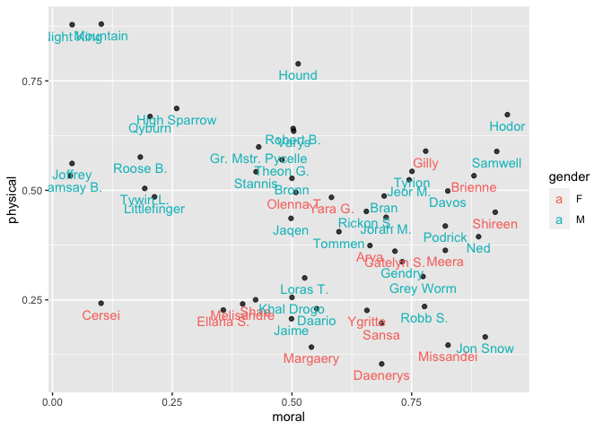
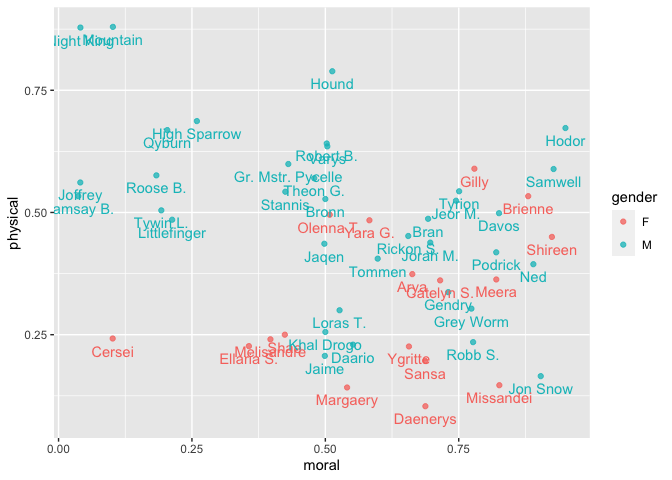

Game of Thromes Character Ratings
================
Angela Zoss
8/1/2022

## Setup your environment

``` r
# Load required libraries

library(tidyverse)
```

    ## ── Attaching packages ─────────────────────────────────────── tidyverse 1.3.2 ──
    ## ✔ ggplot2 3.3.6     ✔ purrr   0.3.4
    ## ✔ tibble  3.1.8     ✔ dplyr   1.0.9
    ## ✔ tidyr   1.2.0     ✔ stringr 1.4.0
    ## ✔ readr   2.1.2     ✔ forcats 0.5.1
    ## ── Conflicts ────────────────────────────────────────── tidyverse_conflicts() ──
    ## ✖ dplyr::filter() masks stats::filter()
    ## ✖ dplyr::lag()    masks stats::lag()

## Load your data

``` r
# data comes from https://int.nyt.com/newsgraphics/2017/2017-07-17-got-matrix/mean.json
# data based on ratings using tool at https://www.nytimes.com/interactive/2017/08/09/upshot/game-of-thrones-chart.html

got <- read_csv("../data/got_ratings.csv")
```

    ## Rows: 53 Columns: 6
    ## ── Column specification ────────────────────────────────────────────────────────
    ## Delimiter: ","
    ## chr (4): character, label, gender, loyalty
    ## dbl (2): moral, physical
    ## 
    ## ℹ Use `spec()` to retrieve the full column specification for this data.
    ## ℹ Specify the column types or set `show_col_types = FALSE` to quiet this message.

## Create a basic plot

``` r
# Remember the basic steps:
# - set the data (main function)
# - choose a shape layer
# - map variables to aesthetics using aes() -> start with x and y in main function

ggplot(got, aes(x=moral,y=physical)) + 
  geom_point()
```

<!-- -->

## Set the alpha (transparency) of all points to .75

``` r
# check ?geom_point to see names of the different options available
# where should the new option go? what layer? inside or outside of aesthetics?

ggplot(got, aes(x=moral,y=physical)) + 
  geom_point(alpha=.75)
```

<!-- -->

## Add labels

``` r
# hint: check https://ggplot2.tidyverse.org/reference/#section-geoms for all geom options

# wrong way: aes() in geom_point does not carry down; has to be in ggplot() or in both geom layers

#ggplot(got) +
#  geom_point(aes(x=moral,y=physical)) + 
#  geom_text(aes(label=label))

ggplot(got, aes(x=moral,y=physical)) + 
  geom_point(alpha=.75) + 
  geom_text(aes(label=label))
```

<!-- -->

## Fix label overlap

``` r
# hint: look at ?geom_text for an option that might change the position slightly
# where should the new option go? what layer? inside or outside of aesthetics?

ggplot(got, aes(x=moral,y=physical)) + 
  geom_point(alpha=.75) + 
  geom_text(aes(label=label), nudge_y = -.025)
```

<!-- -->

## Inheritance: Add colors

``` r
# add gender as a color three different ways:
# - points only
# - labels only
# - both

ggplot(got, aes(x=moral,y=physical)) + 
  geom_point(aes(color=gender), alpha=.75) + 
  geom_text(aes(label=label), nudge_y = -.025)
```

<!-- -->

``` r
ggplot(got, aes(x=moral,y=physical)) + 
  geom_point(alpha=.75) + 
  geom_text(aes(label=label, color=gender), nudge_y = -.025)
```

<!-- -->

``` r
ggplot(got, aes(x=moral,y=physical, color=gender)) + 
  geom_point(alpha=.75) + 
  geom_text(aes(label=label), nudge_y = -.025)
```

<!-- -->

## Turn off legend for text layer

``` r
# hint: there is another property for the geom_text layer that might help

ggplot(got, aes(x=moral,y=physical, color=gender)) + 
  geom_point(alpha=.75) + 
  geom_text(aes(label=label), nudge_y = -.025, show.legend = FALSE)
```

<!-- -->
