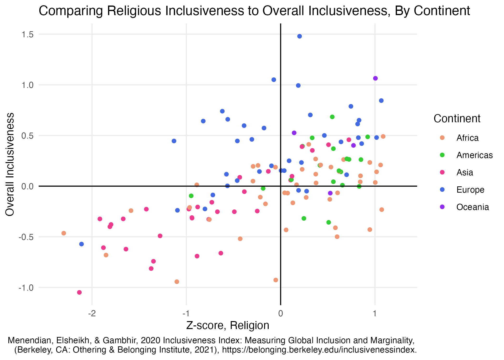

```{r setup, include=FALSE}
knitr::opts_chunk$set(message = FALSE)
```

## Setup your environment

```{r}

# Load required libraries

library(tidyverse)

```

## Load your data

```{r}

gap <- read_csv("../data/gapminder_avg.csv")
names(gap) <- make.names(names(gap), unique=TRUE)

```

## Create and save charts

### Standard plot output in RStudio

```{r}

ggplot(gap, aes(x=Average.GDP.per.capita, y=Average.Life.expectancy.at.birth)) +
  geom_point(aes(size=Average.Total.population, color=Region)) +
  scale_x_log10() + 
  labs(x="Average GDP per capita (log 10)", y="Average life expectancy at birth", title="Averages across all years of the traditional Gapminder dataset") +
  scale_size_continuous(name="Average total population", breaks=c(7500000,75000000,750000000),labels=c("7.5 million","75 million","750 million")) +
  geom_smooth(method="lm", se=FALSE, color="gray50") +
  geom_text(data=gap %>% filter(Average.Total.population>200000000), aes(label=Country)) +
  theme_bw()
```

### Save with defaults

```{r}
# On my machine, this creates a file 2156 pixels wide and 1332 tall; 
# that may be different on your machine
ggsave("../Figs/1-simple_save.png")
```



### Save with smaller width and height

```{r}
# Try setting width and height
# This uses a default unit of inches and a default dpi of 300
ggsave("../Figs/2-ratio_save.png", width=3, height=2)
```


### Save for letter page

```{r}
# That's pretty small, and on my machine text is way too large; 
# let's make it big enough to fit across a letter page
ggsave("../Figs/3-ratio_save2.png", width=6.5, height=4.25)
```


### Save large version

```{r}
# What if we need a big version for a poster?
ggsave("../Figs/4-big_save.png", width=12, height=9)
```


### Update plot base font size for large version

```{r}
# Plenty of pixels, but the text is now way too small!

# This will look very strange in RStudio, but be patient!
ggplot(gap, aes(x=Average.GDP.per.capita, y=Average.Life.expectancy.at.birth)) +
  geom_point(aes(size=Average.Total.population, color=Region)) +
  scale_x_log10() + 
  labs(x="Average GDP per capita (log 10)", y="Average life expectancy at birth", title="Averages across all years of the traditional Gapminder dataset") +
  scale_size_continuous(name="Average total population", breaks=c(7500000,75000000,750000000),labels=c("7.5 million","75 million","750 million")) +
  geom_smooth(method="lm", se=FALSE, color="gray50") +
  geom_text(data=gap %>% filter(Average.Total.population>200000000), aes(label=Country)) +
  theme_bw(base_size=20)

# This has a nice high resolution, and the text is a more reasonable size
ggsave("../Figs/5-big_base.png", width=12, height=9)
```


### Update plot label size for large version

```{r}
# Note: base_size scales everything up except for the geom_text layer
# can change that size separately
ggplot(gap, aes(x=Average.GDP.per.capita, y=Average.Life.expectancy.at.birth)) +
  geom_point(aes(size=Average.Total.population, color=Region)) +
  scale_x_log10() + 
  labs(x="Average GDP per capita (log 10)", y="Average life expectancy at birth", title="Averages across all years of the traditional Gapminder dataset") +
  scale_size_continuous(name="Average total population", breaks=c(7500000,75000000,750000000),labels=c("7.5 million","75 million","750 million")) +
  geom_smooth(method="lm", se=FALSE, color="gray50") +
  geom_text(data=gap %>% filter(Average.Total.population>200000000), aes(label=Country), size=10) +
  theme_bw(base_size=20)

ggsave("../Figs/6-big_labels.png", width=12, height=9)

```

