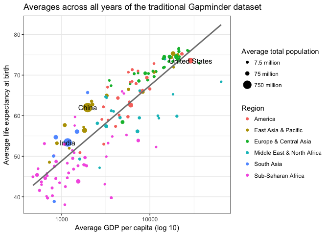

## Setup your environment

```{r}

# Load required libraries

library(tidyverse)
library(here)
here::i_am("Day 2/1-gapminder_avg_final.Rmd")

```

## Load your data

```{r}

# data comes from http://www.gapminder.org/

gap <- read_csv(here("data", "gapminder_avg.csv"))
names(gap) <- c("country","gdp","life.exp","pop","region","color")

```

## Try to reproduce this graphic



(To open the image in a new window, navigate into the images directory and click on the file name.)

```{r}

ggplot(gap, aes(x=gdp, y=life.exp)) +
  geom_point(aes(size=pop, color=region)) +
  scale_x_log10() + 
  labs(x="Average GDP per capita (log 10)", y="Average life expectancy at birth", title="Averages across all years of the traditional Gapminder dataset") +
  scale_size_continuous(name="Average total population", breaks=c(7500000,75000000,750000000),labels=c("7.5 million","75 million","750 million")) +
  geom_smooth(method="lm", se=FALSE, color="gray50") +
  geom_text(data=gap %>% filter(pop>200000000), aes(label=country)) +
  theme_bw()

```
