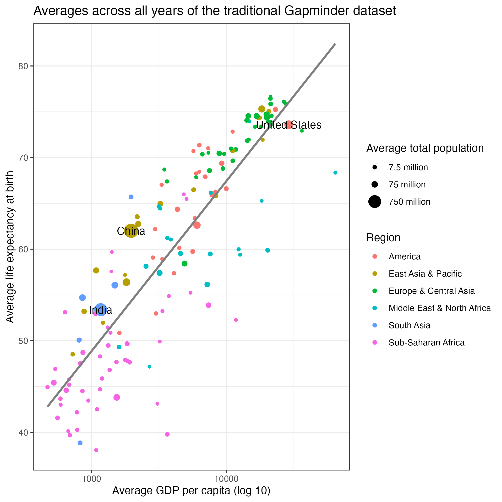

```{r setup, include=FALSE}
knitr::opts_chunk$set(message = FALSE)
```

## Setup your environment

```{r}

# Load required libraries

library(tidyverse)
library(here)
here::i_am("Day 2/2-output-examples.Rmd")

```

## Load your data

```{r}

gap <- read_csv(here("data", "gapminder_avg.csv"))
names(gap) <- c("country","gdp","life.exp","pop","region","color")
output_dir <- "Day 2/images"

```

## Create and save charts

### Standard plot output in RStudio

```{r}

ggplot(gap, aes(x=gdp, y=life.exp)) +
  geom_point(aes(size=pop, color=region)) +
  scale_x_log10(breaks=c(1000,10000)) + 
  labs(x="Average GDP per capita (log 10)", y="Average life expectancy at birth", title="Averages across all years of the traditional Gapminder dataset", color="Region") +
  scale_size_continuous(name="Average total population", breaks=c(7500000,75000000,750000000),labels=c("7.5 million","75 million","750 million")) +
  geom_smooth(method="lm", se=FALSE, color="gray50") +
  geom_text(data=gap %>% filter(pop>200000000), aes(label=country)) +
  theme_bw()

```

### Save with defaults

```{r}
# On my machine, this created a file 2100 pixels wide and 2100 tall; 
# that may be different on your machine
ggsave(here(output_dir, "1-simple_save.png"))
```



### Save with smaller width and height

```{r}
# Try setting width and height
# This uses a default unit of inches and a default dpi of 300
ggsave(here(output_dir, "2-ratio_save.png"), width=3, height=2)
```


### Save for letter page

```{r}
# That's pretty small, and on my machine text is way too large; 
# let's make it big enough to fit across a letter page
ggsave(here(output_dir, "3-ratio_save2.png"), width=6.5, height=4.25)
```


```{r}
# If you get the plot to a proportion that looks right for your purposes,
# you may want to save the plot as a PDF instead of a more restricted image 
# format like PNG or JPG. The PDF file should be a "vector" file, which means
# that it will scale up or down and still look crisp and sharp.

ggsave(here(output_dir, "3-ratio_save2.pdf"), width=6.5, height=4.25)

# SVG is another vector format, and it can be even easier to edit outside of
# R. For example, you can import an SVG into PowerPoint, and if you right-click
# on it and select "Convert to Shape", it will create individual, editable shapes
# for all of the chart components.

# If you want to save as an SVG file, you need the package svglite.

# install.packages("svglite")
# library(svglite)
# ggsave(here(output_dir, "3-ratio_save2.svg"), width=6.5, height=4.25)

# NOTE: for either PDF or SVG files, you may be more restricted where you can
# embed them. Not every publication format will treat PDFs and SVGs as images.
# 

```


### Save large version

```{r}
# What if we need a big version for a poster and can't use a PDF image?
ggsave(here(output_dir,"4-big_save.png"), width=12, height=9)
```


### Update plot base font size for large version

```{r}
# Plenty of pixels, but the text is now way too small!

# This will look very strange in RStudio, but be patient!
ggplot(gap, aes(x=gdp, y=life.exp)) +
  geom_point(aes(size=pop, color=region)) +
  scale_x_log10(breaks=c(1000,10000)) + 
  labs(x="Average GDP per capita (log 10)", y="Average life expectancy at birth", title="Averages across all years of the traditional Gapminder dataset", color="Region") +
  scale_size_continuous(name="Average total population", breaks=c(7500000,75000000,750000000),labels=c("7.5 million","75 million","750 million")) +
  geom_smooth(method="lm", se=FALSE, color="gray50") +
  geom_text(data=gap %>% filter(pop>200000000), aes(label=country)) +
  theme_bw(base_size=20)

# This has a nice high resolution, and the text is a more reasonable size
ggsave(here(output_dir, "5-big_base.png"), width=12, height=9)
```


### Update plot label size for large version

```{r}
# Note: base_size scales everything up except for the geom_text layer and 
# the relative size of the bubbles.
# Can change size of text and bubbles separately.
# Add "size" to geom_text() layer, and add "range" to scale_size_continuous().
ggplot(gap, aes(x=gdp, y=life.exp)) +
  geom_point(aes(size=pop, color=region)) +
  scale_x_log10(breaks=c(1000,10000)) + 
  labs(x="Average GDP per capita (log 10)", y="Average life expectancy at birth", title="Averages across all years of the traditional Gapminder dataset", color="Region") +
  scale_size_continuous(name="Average total population", breaks=c(7500000,75000000,750000000),labels=c("7.5 million","75 million","750 million"), range = c(1, 18)) +
  geom_smooth(method="lm", se=FALSE, color="gray50") +
  geom_text(data=gap %>% filter(pop>200000000), aes(label=country), size=10) +
  theme_bw(base_size=20)

ggsave(here(output_dir, "6-big_labels.png"), width=12, height=9)

```

